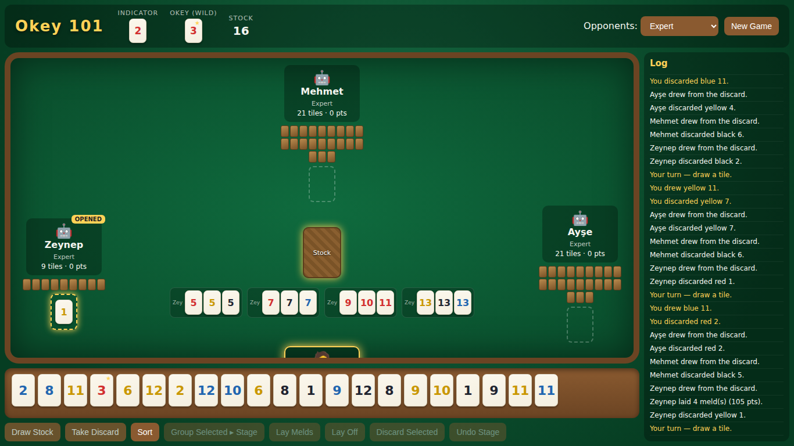
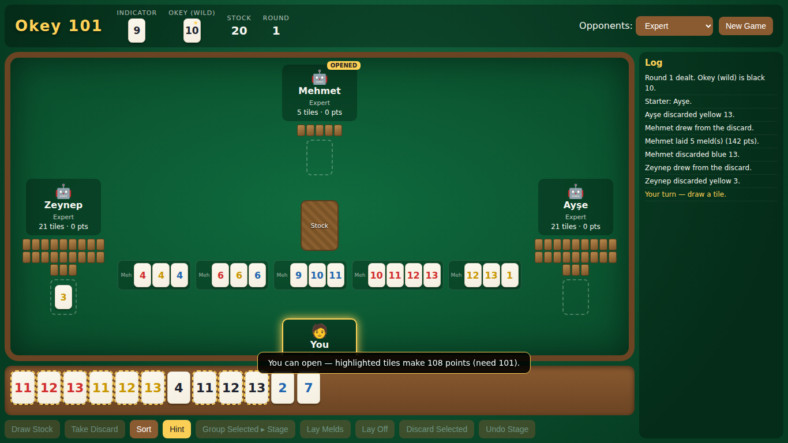

# Okey 101 — Offline

A single-player, **offline** implementation of the Turkish tile game
**Okey 101 (Yüzbir Okey)**. You play one seat at a four-person table against
three AI opponents. No server, no internet, no build step — just open
`index.html` in any modern browser.



## Play

Open **`index.html`** (double-click it, or serve the folder). Pick an opponent
difficulty, hit **New Game**, and play.

### The rules in brief

- **Tiles (106):** numbers 1–13 in four colours (red, yellow, black, blue),
  two of each (104), plus **two false jokers**.
- **The okey (wild):** an *indicator* tile is revealed; the okey is the next
  number up in the same colour (13 wraps to 1).
  - The two real okey-value tiles are **wild** (marked ★) and can stand in for
    anything.
  - The two **false jokers** (✵) act as a normal okey-value tile.
- **Melds:**
  - **Run** — 3+ consecutive numbers of the same colour (1 may be low, `1-2-3`,
    or high, `12-13-1`).
  - **Group** — 3–4 tiles of the same number in different colours.
- **Opening:** your first melds laid down must total **≥ 101 points**
  (ace = 11, other tiles = face value).
- **Going out:** once you've opened, get rid of every tile — meld/lay off all
  but one and discard the last to win the round.
- **Scoring:** the round winner gets a −101 bonus; everyone else adds the value
  of the tiles left in their hand. **Lowest total wins.**

### Your turn

1. **Draw** — click the **Stock** pile, or **Take Discard** from the player on
   your left (highlighted).
2. **Meld** (optional):
   - Click tiles in your rack to select them, press **Group Selected ▸ Stage**
     to stage a valid run/group, repeat, then **Lay Melds** to place them.
     (Your first lay must reach 101.)
   - After you've opened, select one tile and click a table meld to **lay off**.
3. **Discard** — select one tile and press **Discard Selected** (or click your
   discard slot).

Use **Sort** any time to tidy your rack, or **Hint** for advice — it points to
the best draw, highlights an opening set (with its point total), flags a tile
you can lay off, or marks the safest discard.

**Laying off** is one click: with a tile selected, any table meld it can legally
join lights up — click the glowing meld to add it.

**Match play:** rounds accumulate into a match. The header shows the round
number, the round-over screen shows who's leading, and your scores and
difficulty choice are saved in the browser (`localStorage`), so a refresh
resumes the match. **New Game** starts a fresh match; **Next Round** continues
the current one.



## Difficulty levels

| Level | Behaviour |
|-------|-----------|
| **Easy** | Draws from the stock almost always, discards fairly naively, opens only when it obviously can. |
| **Medium** | Keeps partial melds, sheds truly dead tiles, opens at 101. |
| **Hard** | Takes useful discards, lays off, avoids feeding the next player, plays toward an efficient finish. |
| **Expert** | Deeper meld search, disciplined joker use, opponent-aware discarding, maximises going-out chances. |
| **Mixed** | One Easy, one Medium, one Hard opponent. |

## Project layout

```
index.html      markup + layout
styles.css      felt-table styling
js/engine.js    pure rules: deck, okey, meld solver, scoring (no DOM)
js/game.js      turn state machine (draw → meld → discard → win)
js/ai.js        the four AI difficulty profiles
js/ui.js        DOM rendering and human interaction
```

`engine.js`, `game.js` and `ai.js` are DOM-free and run under Node, so the
rules and AI can be unit-tested and simulated headlessly.

## Developing / testing

The logic modules export for Node via `module.exports`, so you can drive full
games without a browser:

```js
const Okey = require('./js/engine.js');
const Game = require('./js/game.js');
const AI   = require('./js/ai.js');

const game = new Game({ humanSeat: -1, difficulties: ['expert','expert','expert'] });
while (!game.roundOver) AI.takeTurn(game, game.current);
console.log('winner:', game.winner, 'scores:', game.scores);
```

## Notes & scope

This implements the core Okey 101 ruleset. A few niche house rules
(e.g. double-going-out / *çift bitiş* bonuses, pair-hands, per-hand okey
bonuses) are intentionally left out to keep the game approachable. The engine is
structured so they can be added on top of `validateMeld` / `finishRound`.
